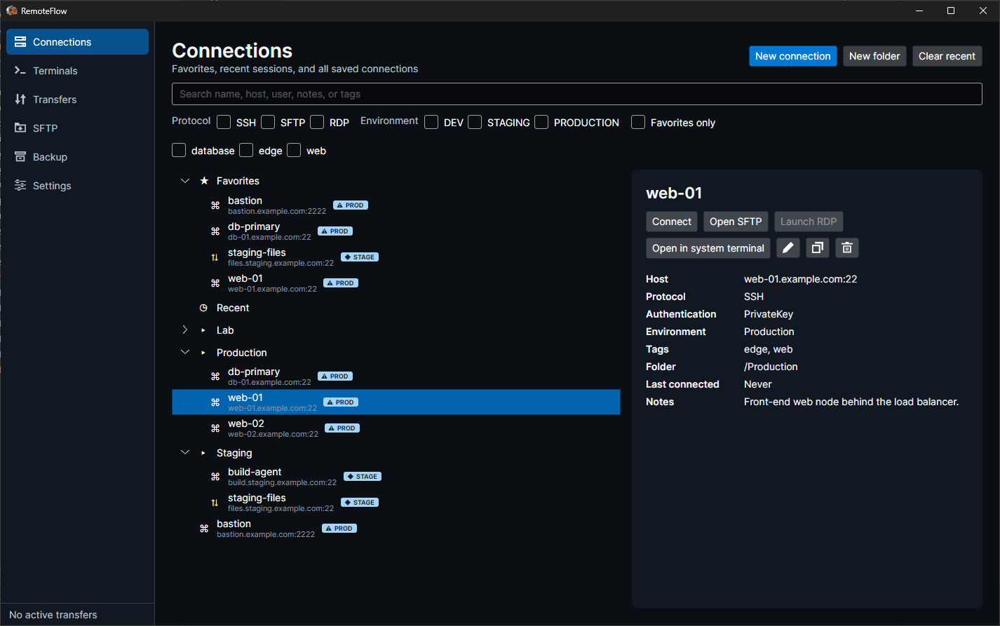
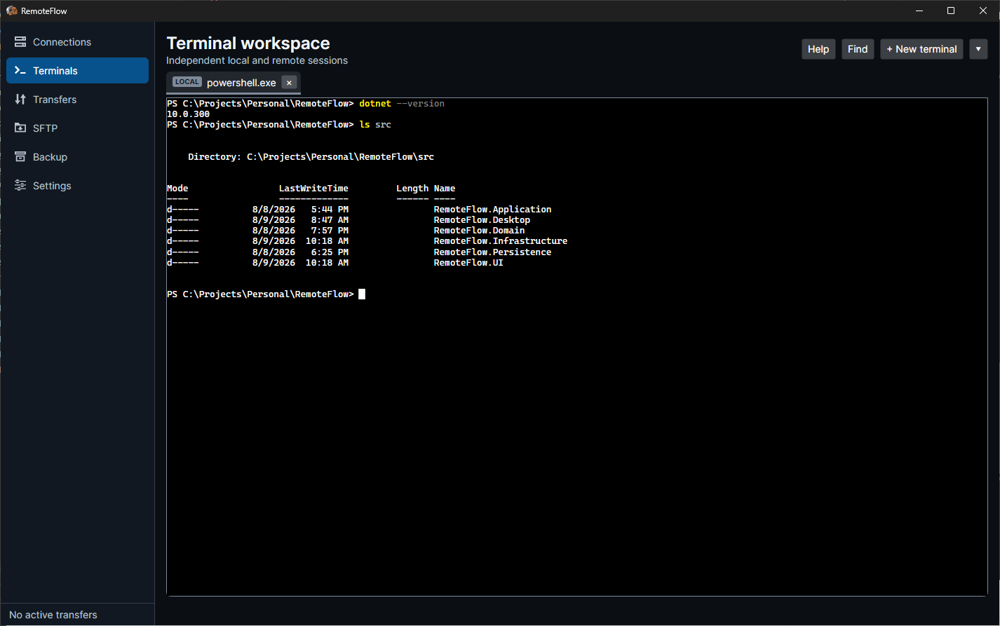
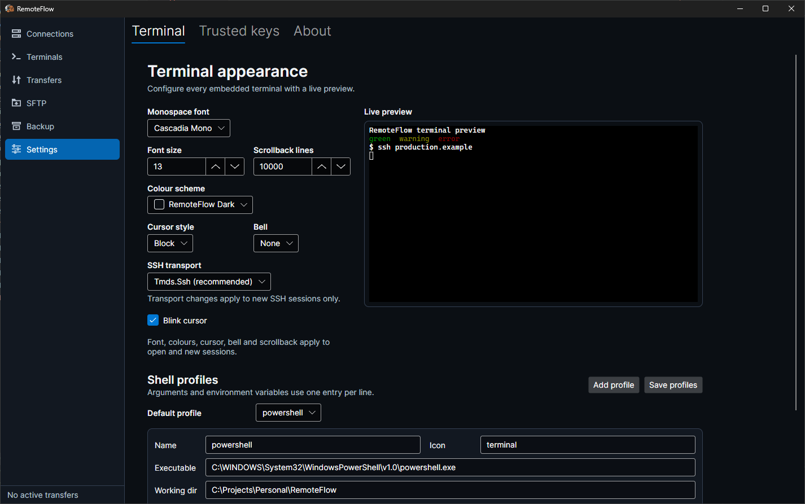

# RemoteFlow

RemoteFlow is a desktop workspace for the machines you administer: SSH sessions, SFTP browsing and
transfers, and Remote Desktop, organised in one place. Connections live in folders with tags and
favourites, terminals open as tabs beside them, and everything stays on your own computer — there is no
account to create and no server behind it. Nothing about you is ever sent anywhere; the only request
RemoteFlow makes that you did not configure is an optional update check, which reads a version number and
is described in [Security posture](#no-telemetry-no-cloud-no-accounts).

It is built with .NET 10 and Avalonia, and runs on Windows, macOS, and Linux. Windows builds are on the
[Releases](../../releases) page; macOS and Linux build from source. See [Install](#install).

## What it does

- **Connections.** Name, host, port, protocol, username, notes, folder, tags, and favourites. Create,
  edit, duplicate, delete, search, and filter by protocol, environment, or tag. Connections are marked
  Development, Staging, or Production, and the badge says which.
- **Terminal workspace.** Local and SSH sessions as tabs in one window, with UTF-8 and ANSI, bracketed
  paste, scrollback search, and the shortcuts listed in [docs/keybindings.md](docs/keybindings.md). Tested
  against vim, nano, tmux, and htop. RemoteFlow does not implement a terminal emulator; it drives
  XTerm.NET over a real PTY.
- **SFTP.** Browse, upload, download, rename, delete, create folders, and change permissions where the
  server allows it. Transfers run in a queue you can watch on the Transfers page.
- **Remote editing.** Open a remote file in your usual editor, keep working, and RemoteFlow uploads it
  when you save — and warns you if the remote copy changed underneath you.
- **Remote Desktop.** **Embedded RDP tabs are Windows-only.** On Windows, choose a live desktop inside
  RemoteFlow or open Remote Desktop Connection as a separate, isolated client; the external action stays
  available as a fallback. Linux and macOS do not load the Windows component and keep the external-client
  workflow, with guidance naming the native client to use when RemoteFlow cannot launch one directly.
- **Backup and restore.** Export connections, folders, tags, settings, and trusted host keys to a ZIP,
  merge or replace on import, and optionally include credentials inside a separate encrypted entry. The
  format is documented and frozen: [docs/backup-format.md](docs/backup-format.md).

## Install

### Windows

Prebuilt Windows artefacts are on the [Releases](../../releases) page: an installer and a portable zip,
each for x64 and ARM64.

- **Installer** — `RemoteFlow-<version>-win-x64-setup.exe`. It installs for your user only, so there is no
  elevation prompt, and adds a Start-menu entry. Uninstalling leaves your connections and settings alone
  unless you say otherwise.
- **Portable zip** — `RemoteFlow-<version>-win-x64.zip`. Right-click the zip → Properties → **Unblock**
  before extracting, then run `RemoteFlow.exe`. Nothing is installed and nothing is written outside
  `%APPDATA%\RemoteFlow` and `%LOCALAPPDATA%\RemoteFlow`.

Pick `win-arm64` on a Snapdragon or Surface Pro X-class machine, `win-x64` otherwise. Both builds are
self-contained: the .NET runtime is inside them, so a clean Windows 11 needs nothing installed first.

Releases are unsigned for now, so Windows will show **"Windows protected your PC"** the first time. See
[the SmartScreen entry in troubleshooting](docs/troubleshooting.md#windows-protected-your-pc-when-i-run-the-installer)
for what that means and how to get past it — and verify the download against the `checksums.txt` published
with the release.

### macOS and Linux

v1 ships no prebuilt macOS or Linux artefacts. Both platforms are supported and build from source in a
couple of commands: see [docs/building.md](docs/building.md).

## Your first connection

1. Start RemoteFlow. The **Connections** page opens with an empty explorer.
2. Click **New connection**. Give it a name, the host, and the port (22 is filled in for SSH), choose
   **SSH** as the protocol, and enter your username.
3. Choose an authentication method. **Private key** lets you pick a key file, and offers to store its
   passphrase; **Password** stores a password. Either way the secret goes into your operating system's
   credential store, never into RemoteFlow's database. You can also leave it unset and be asked at
   connection time.
4. Save, then click **Connect**.
5. The first time you reach a host, RemoteFlow shows its key: the SHA-256 fingerprint and the randomart
   image, exactly as OpenSSH would. **Compare it against the fingerprint you got from the server** — for
   example from `ssh-keyscan` run somewhere you trust, or from whoever runs the machine. Accept it and
   RemoteFlow remembers it; every later connection is checked against it and a change is reported loudly.
6. A terminal tab opens on the **Terminals** page. From the connection's details you can also open
   **SFTP** for the same host, or **Open in system terminal** to hand it to your usual terminal
   application.

If something goes wrong along the way, [docs/troubleshooting.md](docs/troubleshooting.md) covers the
failures people actually hit.

## Security posture

RemoteFlow is a local application that holds the keys to your servers. This section says exactly what it
does with them.

### No telemetry, no cloud, no accounts

There is no analytics, no crash reporting, no licence check, and no sign-in. RemoteFlow opens network
connections to the hosts *you* configure, and makes exactly one other request — the update check, and only
when you ask for it. Diagnostics stay on your machine: the About tab in Settings shows the log folder and
opens it for you.

#### The update check

It is off until you turn it on, and it is the whole of RemoteFlow's contact with the outside world.

- **It only runs when asked.** Pressing **Check for updates** on the About tab runs one check. Ticking
  **Check automatically** runs one more each time RemoteFlow starts, and nothing in between — there is no
  timer and no background poll. Untick it and RemoteFlow makes no unprompted request ever again.
- **What it sends.** One HTTPS GET to `api.github.com` for this project's newest release. The request
  carries a `User-Agent` of `RemoteFlow/<version>`, which names the software. There is no account, no
  licence key, no installation identifier, and nothing describing your machine, your connections, or your
  use of the application. GitHub sees a request from your IP address, as any website you visit does.
- **What it does with the answer.** Reads the version number, compares it with this build, and puts a
  sentence on screen. The check itself downloads nothing.
- **Installing is a separate press.** If a newer release exists you get **Download and install** as well as
  a link to the release page. Pressing it asks first, and says what it is about to do: it downloads that
  release's installer from `github.com`, checks it against the SHA-256 in the `checksums.txt` published
  with the release, and — only if that matches — closes RemoteFlow, installs, and opens it again. Your
  connections and settings are untouched. If the checksum does not match, nothing is installed and the
  download is deleted.
- **What that check is, and what it is not.** It proves the download arrived intact. It does not prove who
  built it: `checksums.txt` comes from the same place as the installer, so the real guarantee is the HTTPS
  connection to `github.com`. RemoteFlow's releases are not code-signed yet, which means Windows cannot
  tell you who published the installer either. If you would rather judge that yourself, leave the check off
  and install from the [Releases](../../releases) page by hand — it is the same file, and the same
  `checksums.txt`.
- **Portable copies still update by hand,** and say so. Only an installed RemoteFlow, running from where
  its own uninstall entry says it is, will replace itself; anything else explains why the button is not
  there rather than leaving you to guess.

### What is stored, and where

| | Windows | macOS | Linux |
| --- | --- | --- | --- |
| Connections, folders, tags, settings, trusted host keys (`remoteflow.db`) | `%APPDATA%\RemoteFlow` | `~/Library/Application Support/RemoteFlow` | `$XDG_DATA_HOME/remoteflow` (`~/.local/share/remoteflow`) |
| Credential fallbacks (`credential-fallback\`, `vault.rfv`) | `%APPDATA%\RemoteFlow` | `~/Library/Application Support/RemoteFlow` | `$XDG_CONFIG_HOME/remoteflow` (`~/.config/remoteflow`) |
| Logs | `%LOCALAPPDATA%\RemoteFlow\Logs` | `~/Library/Logs/RemoteFlow` | `$XDG_STATE_HOME/remoteflow/logs` |
| Scratch files (remote edits, `.rdp` handover) | `%LOCALAPPDATA%\RemoteFlow\Cache` | `~/Library/Caches/RemoteFlow` | `$XDG_CACHE_HOME/remoteflow` |

The database is a plain SQLite file. It holds connection metadata, usernames, notes, and *references* to
credentials — never a credential itself.

### What is never stored

- **No password or passphrase is ever written to the database**, in any form.
- **No password is written into a `.rdp` file**, not even as the encrypted blob the format permits. If you
  have saved an RDP password, it is handed to Windows for the seconds the client needs to start and taken
  straight back out again; the generated `.rdp` lives in a per-launch folder that is deleted afterwards.
- **No secret reaches the log files.** Logging runs through a redacting provider: values registered as
  secrets and fields whose names look like credentials are replaced with `[REDACTED]`.
- **No secret leaves a backup unencrypted.** Every entry in a backup ZIP is plaintext except
  `credentials.enc`, which is optional, and which is written only when you supply a passphrase.

### How credentials are held

Passwords, private-key passphrases, and RDP passwords go to the platform's own credential store, under
keys of the form `remoteflow/connection/<connection-id>/<kind>`:

| Platform | Store |
| --- | --- |
| Windows | Windows Credential Manager (generic credentials). If Credential Manager is unavailable — no logon session, a locked-down SKU — RemoteFlow falls back to DPAPI-encrypted files under `credential-fallback\`, readable only by your Windows account. |
| macOS | The login keychain, through `Security.framework`. |
| Linux | The Secret Service via libsecret — GNOME Keyring, KWallet, or whatever your desktop provides. |

When no keyring is available, RemoteFlow can use its own encrypted file vault, `vault.rfv`: Argon2id
(64 MiB, 3 iterations) derives a key from a passphrase, and each secret is sealed with AES-GCM under it.
See [the libsecret entry in troubleshooting](docs/troubleshooting.md#linux-says-os-keyring-unavailable---using-passphrase-vault)
for what that means in practice today.

### How host keys are verified

Every SSH connection has a host key policy:

- **Trust on first use** (the default) shows you the SHA-256 fingerprint and randomart on the first
  connection and remembers what you accept.
- **Strict** never prompts. The key must already be trusted — import it from a `known_hosts` file first.
- **Accept any** connects without verification and flags the connection as unverified. It exists for
  throwaway lab machines; it is not a setting to leave on.

A key that changes is never accepted silently: RemoteFlow shows the stored fingerprint next to the
presented one and makes you choose. A key you mark revoked refuses the connection outright. Trusted keys
are listed under **Settings → Trusted keys**, and `known_hosts` entries — including hashed hostnames —
can be imported. Comparison is constant-time.

### Reporting a problem

Security issues go through [SECURITY.md](SECURITY.md), privately, not through a public issue.

## Documentation

| | |
| --- | --- |
| [docs/keybindings.md](docs/keybindings.md) | Terminal bindings and the embedded-RDP focus/shortcut limitations. |
| [docs/manual-test-rdp-embedded.md](docs/manual-test-rdp-embedded.md) | The release-blocking Windows embedded-RDP playbook, including native ARM64. |
| [docs/troubleshooting.md](docs/troubleshooting.md) | Concrete symptoms and concrete fixes. |
| [docs/accessibility.md](docs/accessibility.md) | Working without a mouse, what a screen reader hears, and the contrast floors. |
| [docs/building.md](docs/building.md) | Building and running from source on Windows, macOS, and Linux. |
| [docs/backup-format.md](docs/backup-format.md) | The v1 backup archive format. |
| [docs/packaging-windows.md](docs/packaging-windows.md) | How the Windows artefacts are produced and signed. |
| [docs/releasing.md](docs/releasing.md) | Tagging, the release workflow, and what a human still has to check. |
| [docs/adr](docs/adr) | Architecture decisions, and why. |
| [CHANGELOG.md](CHANGELOG.md) | What changed, per release. |

## Contributing

[CONTRIBUTING.md](CONTRIBUTING.md) covers the local checks, the changelog convention, and how third-party
licences are kept current. [docs/manual-test-terminal.md](docs/manual-test-terminal.md) is the manual
terminal test pass to run when touching the terminal stack. Windows embedded-RDP changes also require
[docs/manual-test-rdp-embedded.md](docs/manual-test-rdp-embedded.md).

## Licence

MIT — see [LICENSE](LICENSE). Third-party packages and their licences are listed in
[THIRD-PARTY-NOTICES.md](THIRD-PARTY-NOTICES.md), which is generated from the packages actually shipped
and embedded in the binary.
