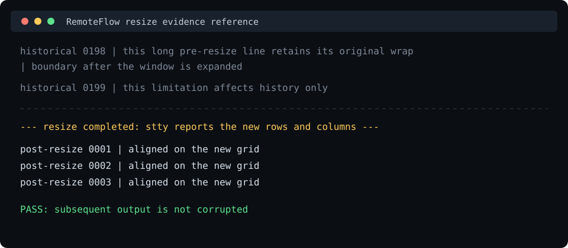

# Terminal stack manual test

ADR-0005 accepts the terminal stack for Windows. Run the applicable Windows checks before every release and after every Avalonia or terminal-stack upgrade. Linux and macOS are currently unsupported; their instructions remain useful for a future platform-validation issue but do not block Windows development or releases.

## Build and launch

Requirements: .NET 10 SDK, a monospace font with the tested glyphs, and the TUI tools listed below.

```shell
dotnet restore RemoteFlow.slnx
dotnet build RemoteFlow.slnx --no-restore
dotnet run --project tools/RemoteFlow.TerminalSpike -- --color truecolor
```

Useful launch options:

```text
--shell <path>             shell executable (defaults to pwsh/cmd on Windows, $SHELL on Unix)
--arg <value>              repeat for each shell argument
--cwd <path>               shell working directory
--color truecolor|256      sets COLORTERM=truecolor or removes it; TERM remains xterm-256color
--read-buffer-size <bytes> force read boundaries; use 1 for the split UTF-8 test
```

For a thorough regression run, execute the visual/color set twice: once with `--color truecolor`, once with `--color 256`. Keep the window at a stable size for performance comparisons. The status area reports terminal dimensions, throughput, terminal-feed time, UI-dispatcher pulse time, working/peak memory, scrollback lines, and the last input bytes. “UI pulse” is a responsiveness proxy, not a GPU frame profiler measurement; record profiler frame time as well if available.

Click **Export evidence** after each performance run. It writes a timestamped JSON file under `artifacts/terminal-spike/`. Copy reviewed evidence into `docs/evidence/terminal/` before updating the ADR.

## Test data

From a bash-compatible shell in the harness:

```shell
mkdir -p /tmp/remoteflow-terminal-spike
seq 1 500 | sed 's/^/RemoteFlow vim line /' > /tmp/remoteflow-terminal-spike/vim-500.txt
seq 1 100000 > /tmp/remoteflow-terminal-spike/less-100000.txt
yes 'RemoteFlow throughput 0123456789 abcdefghijklmnopqrstuvwxyz' | head -c 10485760 > /tmp/remoteflow-terminal-spike/10mib.txt
```

Use equivalent PowerShell-generated files when testing native Windows tools. Keep generated files outside the repository.

## TUI correctness

Record Windows regressions with enough detail to reproduce them. Do not retroactively convert ADR-0005's owner-level acceptance into row-level pass evidence.

### vim

1. Open the 500-line file.
2. Navigate to the beginning/end and through several pages.
3. Run `:set number` and verify the number column and status line.
4. Make a visual-block selection and edit it.
5. Run a substitution such as `:%s/RemoteFlow/RemoteFlow-spike/g`.
6. Save and quit with `:wq`.
7. Repeat in 256-color and truecolor modes. Verify syntax colors and capture a screenshot in each.

Fail for corrupted cells, a displaced status line, wrong hard color modes, or unusable navigation. A documented emoji-width mismatch alone is not a blocker.

### nano

Edit and save a file with Ctrl+O, search with Ctrl+W, inspect the help bar, and exit with Ctrl+X. Verify that the shortcuts reach nano rather than the host window.

### tmux

Create a session, split it horizontally and vertically, switch panes, and inspect every border intersection. Enter copy mode with prefix + `[`, scroll, detach, and attach again. Verify the restored panes exactly.

### htop

Run for at least 60 seconds at a one-second refresh. Watch for drift, stale cells, or artifacts. Exercise all visible F-key actions and verify colors/meters.

### less and alternate screen

Open the 100,000-line file with `less`. Exercise PgUp/PgDn, `/search`, `G`, and `q`. Before launching each full-screen tool, print a distinctive marker and several numbered lines. On exit, verify the normal buffer is restored byte-for-byte visually, including the marker and cursor position.

## Encoding

Print a line containing `漢字`, `é` (combining accent), `┌─┬─┐│└─┴─┘`, and `🙂`. Verify cell alignment against an ASCII ruler above and below it.

Click **UTF-8 split probe**. It sends the first byte of `漢` separately from the remaining bytes. Then relaunch the harness with `--read-buffer-size 1` and print the same line from the child shell; this forces multibyte PTY output across read calls. Neither run may display replacement glyphs or shift later cells.

## Keyboard and paste

1. Run `yes`, press Ctrl+C, and confirm it stops. The status area must show last input bytes `03`.
2. Run `cat`, press Ctrl+D, and confirm EOF. In a job-control shell, start a foreground process, press Ctrl+Z, and confirm it suspends.
3. In vim insert mode, test arrows, Home, End, PgUp, PgDn, and Delete.
4. Verify Alt+letter arrives as an ESC-prefixed sequence (the status hex starts with `1B`) and test F1-F12 in an application that displays their bindings.
5. Enable vim paste handling normally, enter insert mode, and use the harness Paste button with multiple indented lines. Verify bracketed paste preserves the indentation instead of triggering auto-indent on every line.

The control converts framework key events into terminal byte sequences before raising `UserInput`; the PTY adapter must forward those bytes unchanged.

## Resize

RemoteFlow deliberately sets `ReflowOnResize = false`. XTerm.NET's normal-buffer resize reflow can
corrupt full-screen TUIs; this is the behavior tracked by
[XTerm.NET issue #12](https://github.com/tomlm/XTerm.NET/issues/12). The tradeoff is limited to
historical normal-buffer lines: already-rendered long lines keep their old wrapping after a resize.
New output uses the new cell grid and must remain correct. The terminal control derives columns and
rows from its active monospace font metrics, while RemoteFlow coalesces resize notifications with a
100 ms trailing debounce before resizing the PTY.

1. Run `watch -n 0.2 'stty size'` or an equivalent loop.
2. Resize the window in both dimensions. Confirm the reported rows/columns match the harness status and the TUI redraws cleanly. This demonstrates the control resize event → `IPtyConnection.Resize` → SIGWINCH path.
3. Produce at least 200 numbered normal-buffer lines, shrink the window, then expand it. Capture the known historical-line reflow gap caused by `ReflowOnResize = false`.
4. Print another 100 numbered lines after resizing. Confirm only historical layout is affected and all subsequent output is correct.

5. Open four terminals, run a TUI (`htop`, `vim`) in each, and press **Grid**. Change the column picker
   between 1 and 4, then return to tabs. Every terminal resizes to its own tile, so each TUI must repaint
   cleanly at its new size and keep taking input; the historical-line gap above applies to each of them.

Capture the result using this framing (replace the image below with the current release candidate's
screenshot when recording release evidence):



## Performance and memory

Production output is delivered in no more than one UI batch per 16 ms frame and at most 64 KiB per
frame. Awaiting each UI batch naturally pauses the `PipeReader` when rendering falls behind. If a
sustained flood grows the pending buffer beyond 4 MiB, RemoteFlow preserves the newest output and
inserts an explicit `[RemoteFlow: output truncated; ...]` marker; output is never discarded silently.

Run each command separately from a fresh harness process and avoid interacting until output finishes:

```shell
cat /tmp/remoteflow-terminal-spike/10mib.txt
find / -type f 2>/dev/null
```

During each run, try moving/resizing the window and type a short command immediately afterward. A frozen window, dropped input, or corrupted output is a failure. Record:

- total MiB and MiB/s;
- mean/max terminal feed milliseconds;
- mean/max UI pulse milliseconds and profiler ms/frame when available;
- peak process working set;
- OS, architecture, shell, and color mode.

For the scrollback budget, start a fresh process, produce exactly 10,000 short numbered lines, wait for memory to settle for 10 seconds, and export evidence. The proposed hard budget is less than 100 MiB process working set. Record the actual line length because it affects memory.

## API smoke checks

1. Drag-select, double-click a word, triple-click a row, click Copy, and paste elsewhere.
2. Right-click with a selection (copy) and without a selection (paste).
3. Search for text in scrolled-off output, cycle through matches with Next, and confirm the viewport follows.
4. Change `FontFamily`, `FontSize`, and selected `SvcSystems.UI.TerminalColor*` resources in the harness, rebuild, and verify the instance/palette hooks take effect.

## Scrollback and find

RemoteFlow uses SvcSystems.UI.Terminal's native buffer-search API for the default case-insensitive,
literal search, so every match receives the control's built-in highlight. Case-sensitive and regular
expression modes evaluate the control's buffer snapshot and use the native selection/navigation hook
for the active result. An invalid or excessively expensive expression is reported in the find bar.

1. Produce 10,000 numbered lines, scroll upward with the wheel, Page Up and the scrollbar, then let new output arrive. The viewport must not jump to the bottom.
2. Return to the bottom and produce more output. The viewport must follow the new output.
3. Press Ctrl+Shift+F, find a repeated word, and navigate forward with Enter and backward with Shift+Enter. Confirm all literal matches are highlighted.
4. Toggle case sensitivity and regex mode. Try a valid pattern and an invalid pattern such as `[`. The invalid pattern must show a message without closing the session.

## Regression outcome

Attach evidence for any failure and apply ADR-0005's reconsideration rule. Passing routine checks requires no ADR status change. Validating Linux or macOS requires a separate issue and an ADR amendment.
